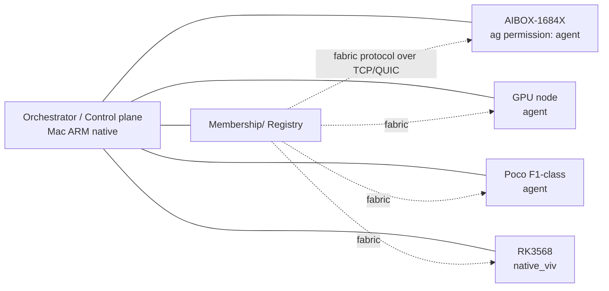
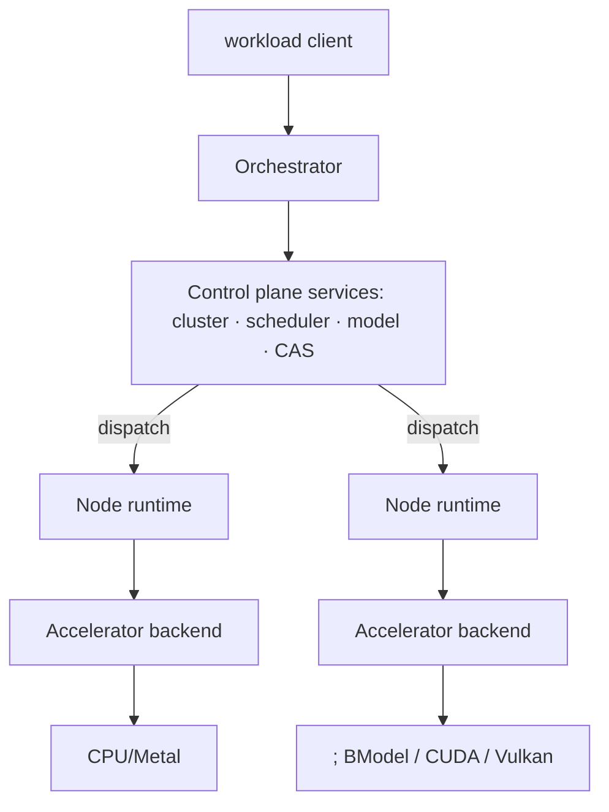
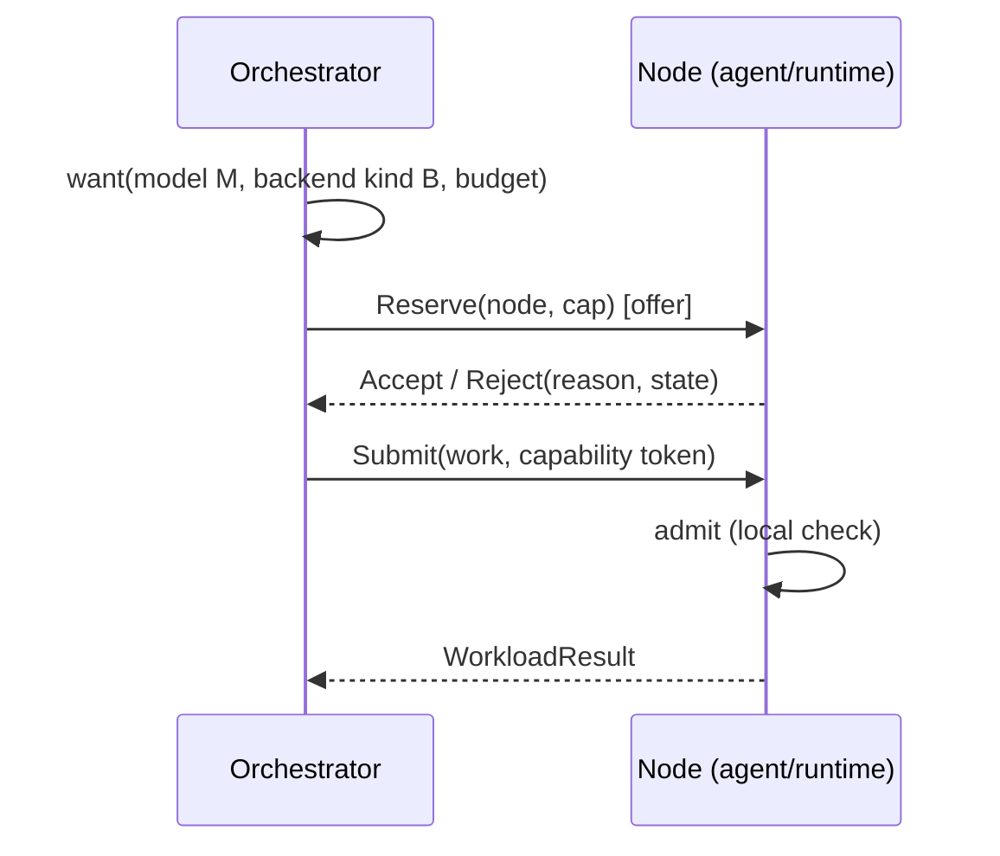

# Vivanta — Distributed Architecture (Proposed Target Architecture)

> **Status:** Proposed target architecture — deliverable 2.
> **Date:** 2026-08-09.
> **Inputs:** `VIVANTA-DISTRIBUTED-ARCHITECTURE-RESEARCH.md` (evidence),
> repository audit (2026-08-09).
> **Companion docs:** `VIVANTA-HETEROGENEOUS-COMPUTE.md` (resource/accelerator
> model), `VIVANTA-DISTRIBUTED-AI.md` (AI/LLM execution),
> `VIVANTA-ROADMAP.md` (gates), ADRs in `docs/adr/`.
>
> This document states **what Vivanta becomes**: layers, node taxonomy,
> mechanisms, protocol, and the mechanism/policy boundary. It is the architectural
> skeleton the other three documents elaborate. It is intentional that the kernel
> makes almost no appearance here: the fabric lives above it.

---

## 1. Vision statement

> **Vivanta is a distributed heterogeneous compute fabric of capability-managed
> resources: a cluster of any-kind machines and accelerators behaves as one
> addressable compute plane, each accelerator keeping its native execution model
> and runtime, every node reachable by identity-menaged capability, driven by a
> single wire protocol in userspace — above an unchanged single-node mechanism
> kernel.**

Two sentences that capture the mechanism- policy split at the fabric level:
- **Mechanism:** capabilities, resources, workloads, execution graphs,
  accelerators, communication — the raw primitives.
- **Policy:** placement, orchestration, admission, model routing, accounting.

The kernel keeps mechanism; userspace keeps policy; the fabric protocol is how
the two meet across nodes.

---

## 2. Architectural pillars

### 2.1 Pillar A — Capability notated resources

Every resource (compute, memory, accelerator, storage, model, workload, device)
**is** a capability-notated object:

```text
Capability { id, subject (resource/device/model/workload),
             rights (read|write|run|manage|delegate),
             issuer (owning node), scope (cluster|node|device|workload),
             ttl, derivation }
```

Rules (inherited from seL4 lineage, per Vivanta RFC-013):
1. Capabilities are **unforgeable** (kernel/user-space issued, signed).
2. Derivation **narrows** rights; never widens.
3. Every distributed op identifies its target **by capability**, not by name.
4. **TTL + signed issuance** make expiry/revocation practical without global
   revocation infrastructure.

Consequence: no node is a universal root. A node holds capabilities only for
*its own resources*; what it lends to the fabric is a subset with rights and
TTL. Revocation = issuer stops renewing + signs a revoke entry; consumers
verify TTL.

### 2.2 Pillar B — One wire protocol (the Fabric protocol)

The fabric protocol is the **single** inter-node language:

- `Advertise(node, identity, resources)`
- `ResourceList{(descriptor, capability_hint)}`
- `WorkloadSpec(name, graph|artifact ref, backends, placement hints)`
- `WorkloadDispatch`, `WorkloadResult`, `WorkloadQuery`
- `Lease(req)`, `Lease(accept|reject with reason)`
- `Heartbeat`, `Membership` (signed)
- `ModelOffer(artifact, hash)`, `ModelRequest`
- `Bulk{Transfer}`, `BulkDone` (the payload channel over the same transport or
  a sibling one)
- `Error`, `Revoke(cap)`t

Properties:
- Every message is signed by the sender's node key (Ed25519).
- Payload idempodencity: `(workload_id, op_seq)`.
- Control channel (small, reliable, ordered) and **bulk channel** (large,
  streaming, retryable) are distinct — the accelerator API and storage both use
  bulk.
- Transport **TCP v1**, **QUIC later** (v1 handshakes Noise-style to derive
  per-pair session keys).

### 2.3 Pillar C — The capability-run accelerator ("opaque artifact") model

Fully in `VIVANTA-HETEROGENEOUS-COMPUTE.md`. Summary:

- Every accelerator implements a **common lifecycle**: `info / allocate /
  upload / execute / wait / release`, plus `vendor` extension channel (typed,
  Any-downcastable).
- Compute is expressed either as **command-level ops** (fine control) or as
  **opaque artifacts** (whole-model: BModel, CUDA module, SPIR-V, ONNX model).
- The fabric never interprets artifacts; it transports and gates them by
  capability. Vendor-specific byte representation lives untouched.

This preserves heterogeneity while keeping a uniform dispatch mechanism.

---

## 3. Layers

```text
┌────────────────────────────────────────────────────────────┐
│  L7  Applications  session/CLI/WEB/notebook                 │
├────────────────────────────────────────────────────────────┤
│  L6  Orchestrator (fabric head)                             │
│      admission, placement, reconciliation, health           │
├────────────────────────────────────────────────────────────┤
│  L5  Fabric services                                        │
│      cluster (identity, membership, discovery) · scheduling │
│      · model registry · CAS · telemetry                     │
├────────────────────────────────────────────────────────────┤
│  L4  Accelerator backends                                   │
│      cpu-lm · metal · cuda · vulkan · bm1684x · openvino    │
├────────────────────────────────────────────────────────────┤
│  L3  Node runtime / agent                                   │
│      resource owner · executor · admission · backend bridge │
├────────────────────────────────────────────────────────────┤
│  L2  Kernel (unchanged)  tasks·threads·IPC·sched·drivers    │
├────────────────────────────────────────────────────────────┤
│  L1  Platform (unchanged)  archaarch64/armv7 · bootinfo      │
└────────────────────────────────────────────────────────────┘
```

Vertical dependency rule: each layer uses only the one (or two) directly below
it; `vivanta-core` is a no-dependency crate shared by many.

---

## 4. Node taxonomy

```
Native Vivanta node     — runs the Vivanta kernel; node runtime in userspace;
                           the research home; full capabilities.
Managed Linux node      — Linux + Vivanta agent (Rust daemon) speaking the
                           same fabric protocol; exposes CPU+GPU+NPU+TPU that
                           Vivanta has no drivers for yet (AIBOX-1684X,
                           GPU boxes, phones).
External accelerator    — a device reachable through an owning node's backend:
                           never a cluster member itself.
```

- The **same protocol** is spoken by native nodes and agents: the fabric does
  not care which one is which.
- A node's identity is its Ed25519 public key; its kind is an advertised
  attribute, not a protocol difference.

---

## 5. Cluster topology



(The single control node is a deliberate v1 choice; read data-distributed
consensus as M17+ work.)

---

## 6. System architecture components



---

## 7. The Fabric scheduling / placement flow



This "offer → accept → admit" is the **two-level scheduler**: the orchestrator
picks the node; the node admits (thermal, battery, load, capability). Exactly
Mesos's offer model, minus the datacenter.

---

## 8. Resource view

```text
Node
 ├── CPU resources (freq, cores, cache hierarchy)
 ├── memory (capacity, latency class, bandwidth)
 ├── storage (capacity, perf)
 ├── network (interfaces, measured bw/rtt)
 └── accelerators []
       ├── GPU   { kind, mem, quant, ops, cost model }
       ├── NPU   { kind, tops, int8/16, cost }
       ├── TPU   { BM1684X … bm type artifact }
       └── custom …
```

Each node advertises a **descriptor set**; the orchestrator holds a 
**clusterview** built from **signed** `Advertise` messages.

---

## 9. Why the kernel is (almost) unchanged

The kernel provides mechanism only. The distributed behavior is **above** it:
per the "services over kernel features" principle. Kernel changes needed (all
generic, all listed already in the roadmap):

- IPC (message passing, shared memory) — M6.
- sockets (user-land poll/connect/listen) — M6.
- storage driver — M7.
- capability enforcement (RFC-013 revival) — M10–M11.

No kernel **scheduler** change, no kernel **memory** change, no AI logic.

---

## 10. What we do NOT build (each has a reason)

| Not built | Reason |
|---|---|
| REST/REST... controller layer | The protocol is our interface; no Kubernetes-style operator model. |
| Distributed hash table / consensus (Raft etc.) | Overkill for ≤20 nodes; single orchestrator with leased state is enough, M17+ if ever. |
| True Distributed Shared Memory | Phone/edge latency × remote paging = UNREALISTIC. |
| Auto-scaled batch of containers | The unit is the workload/operator, not containers. |
| In-kernel GPU/TPU drivers | Vendor blobs stay userspace via agents; native drivers come later if ever. |
| Own compiler IR | Consume artifact box (ONNX/StableHLO interchange; vendor compilers produce the executable artifact). |

---

## 11. Capability + security model (summary)

- Node keys: **Ed25519 node keypair** from persistent identity, stored via MMU
  user identity store (M7+).
- Derivation + TTL empowers the "no universal root" requirement:
  - An agent exports **only its own resources** with limited capabilities.
  - A workload receives **only the rights it needs** (least privilege).
- Transport: Noise protocol handshake (Ed25519 → symmetric session keys);
  later QUIC+TLS1.3.
- Model artifacts are **signed content-addressed objects**; loading verifies
  hash and signature.

---

## 12. Relationship to existing Vivanta

| Existing | Relationship |
|---|---|
| RFC-010 MemoryBackend/MRM | Extended to `vivanta-resource` descriptors (remote backends). |
| RFC-001 Identity | Node identity extends Ed25519 identity; persistent keys after M7. |
| RFC-013 capabilities (frozen) | The Pillar A design IS resumed/adapted as `vivanta-core` capabilities, to be revived in implementation when userspace exists. |
| Device graph / ADR-022 | Advertised resource/accelerator graphs. |
| `network-services-vision.md` | Node service = user-level network service; kernel never learns protocols. |
| M6+ roadmap | Sequencing in `VIVANTA-ROADMAP.md`. |

---

## 13. Acceptance (what "distributed" means we can claim)

The architecture is **implemented enough to claim** when:

1. Two nodes (native and/or agent) form a cluster via signed `Advertise`.
2. An orchestrator placed a workload of node-preferred (e.g., "run this DAG on
   GPU") via capability.
3. A workload can be **interrupted, restarted from a CAS checkpoint** on a
   different node.
4. A model artifact (BModel / GGUF) flows: package → registry → node → backend.
5. One crashing node does not prevent others from serving; leases recover.

---

*Next: `VIVANTA-HETEROGENEOUS-COMPUTE.md`.*